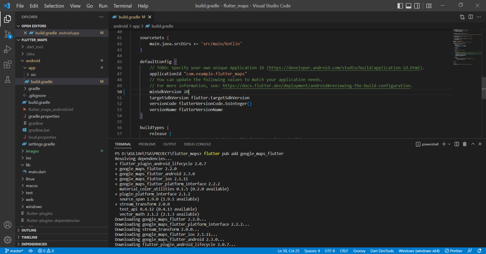
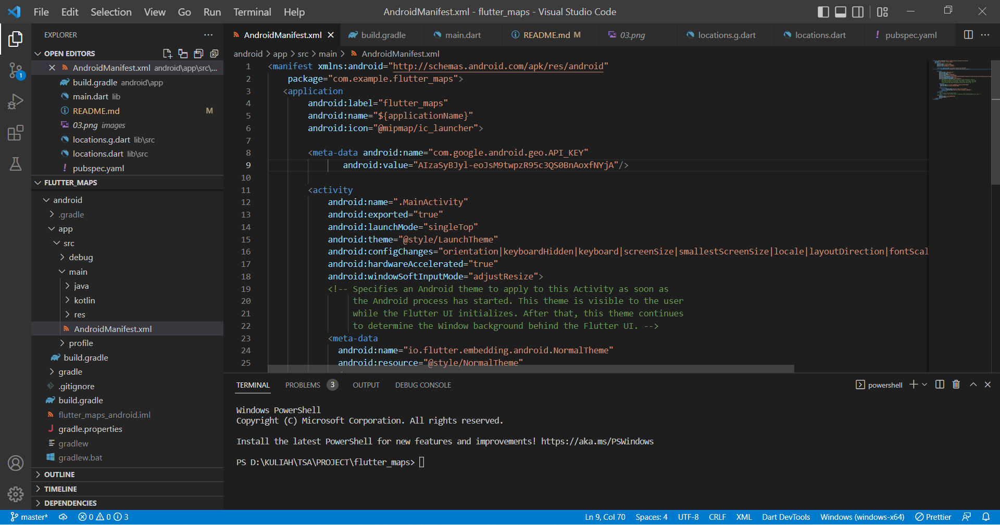
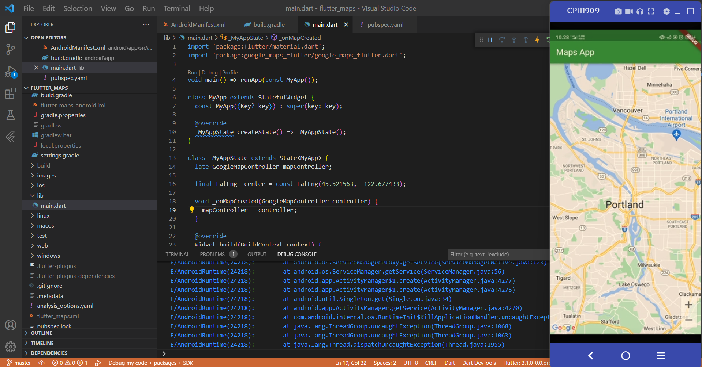
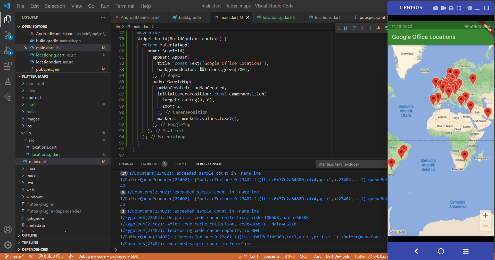
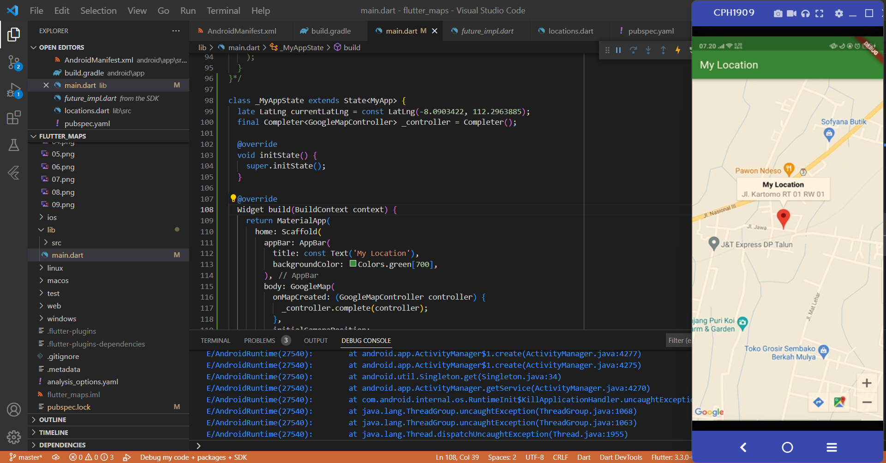

# flutter_maps

Praktikum Flutter Maps

## Menambahkan plugin Google Maps Flutter sebagai dependensi

Pada praktikum ini, kita akan menambahkan plugin google maps untuk menampilkan maps di device kita.

```
flutter pub add google_maps_flutter
```

## Konfigurasi minSDK Android


## Menambahkan kunci API untuk aplikasi Android


## Menampilkan Maps di layar


## Menempatkan Google di Peta


## Tugas Praktikum
Buatlah aplikasi flutter yang dapat menampilkan peta dan beri tanda (marker) posisi rumah atau tempat tinggal Anda masing-masing!
